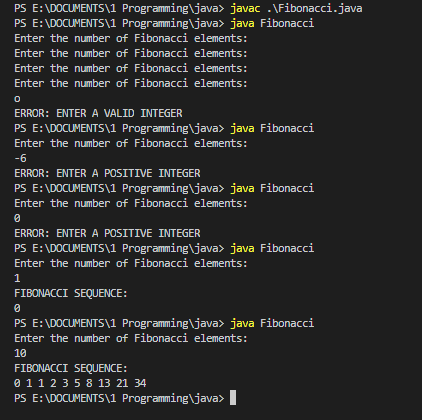

# Agencify_Java

# ASSESSMENTS Q1:FIBONACCI SEQUENCE
This program prints the first `n` values in a Fibonacci sequence where `n` is input by the user

The program utilizes four variables 
`n_0, n_1, fib` and `length`
The first values in the Fibonacci series are `0` and `1`
To obtain successive values, the following formula is applied 
$$
fib=n_0+n_1
$$
Then the `n_1` becomes the next `n_0` and `fib` is assigned to `n_1`
```java
System.out.println("FIBONACCI SEQUENCE:");
System.out.print("0");
if (length >= 2) {
    System.out.print(" 1");
}
for (int i = 2; i < length; i++) {
    fib = n_0 + n_1; // Calculate fib by sum of prev and next elements
    System.out.print(" " + fib); // Display fib
    n_0 = n_1; // The new previous value is what was in the next variable
    n_1=fib; // The new next value is the calculated fibonacci value
    }
```
The loop begins at `i=2` since the initial `0` and `1` have already been printed outside the loop
The program implements error handling to restrict valid input for the size of the sequence

Invalid input include letters, negative numbers and zero



# ASSESSMENTS Q2: LARGEST DIFFERENCE CALCULATOR
This program calculates the largest difference in a list of elements. For example 
$$
[4, 1, 9, 3, 7] => 9-1=8
$$
The ***logic*** of this program is based on the fact that the largest difference is obtained from the difference between the maximum value and the minimum value
$$
largestDifference=maximum-minimum
$$

We can optimize this program by first sorting the list to easily access the maximum and minimum values. This also helps not to worry about the issue of duplicate values in the list.

Java has a class as part of its collections framework which has several advantages including sorting, accessibility and resizability. This class is the `java.util.ArrayList`
```java
ArrayList<Integer> list = new ArrayList<Integer>();
```
This variable will store the list of numbers which we then pass to the `int getLargestDifference(ArrayList<Integer> list)` function

This function returns 0 incase the list has less than 2 elements
```java
if (list.size() < 2) {
    return 0;
}
```

For efficiency purposes, we sort the list 
```java
java.util.Collections.sort(list);
```

This therefore caters for the case where there are duplicates in the list
$$
[4, 1, 4, 3, 4] => 4-1=3
$$

Then subtracting the minimum from the maximum we get our difference
```java
difference = list.get(list.size() - 1) - list.get(0); // maximum-minimum=largest difference
return difference;
```
        
## ASSESSMENTS Q3: EMPLOYEES SQL
We assume that the database and all the elements have been created and that we can access

* table name: employees
* columns: 
* id(integer)
* name(text)
* age(integer)
* salary(float)

Write a SQL query that selects all employees whose age is
  above 30 and salary is above $50,000.
```SQL
SELECT * FROM employees WHERE age>30 AND salary>50000;
```
The query extracts all the employees from the employees table and the criteria is `age` is greater than `30` and `salary` is greater than `50,000`

## ASSESSMENTS Q4: AverageCalculator
The program in its originality seems to have no error since the correct average for 
$$
[5, 10, 15, 20, 25]=>15.0
$$
 The error is detected upon testing the program with different values. That is using values whose average is a floating point value(decimal).
 
 For example:
 $$
 average [2,3,4,5]=3.5
 $$
 
 The erroneous program displays an average of 3.0 
 
 This is because *integer* divide by *integer* results to an *integer*
 Therefore there is a need to make one of the integers(either the divisor or the dividend) a double or float

 The program can be therefore be corrected by making total a double instead of `int total = 0`
```java
public static double calculateAverage(int[] numbers) {
    double total = 0;
    for (int num : numbers) {
        total += num;
    }
    double average = total / numbers.length;
    return average;
    }
```
Therefore the division is no longer **integer/integer** but **double/integer** which is an **integer**
